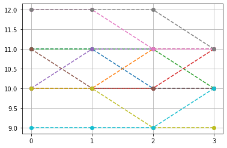
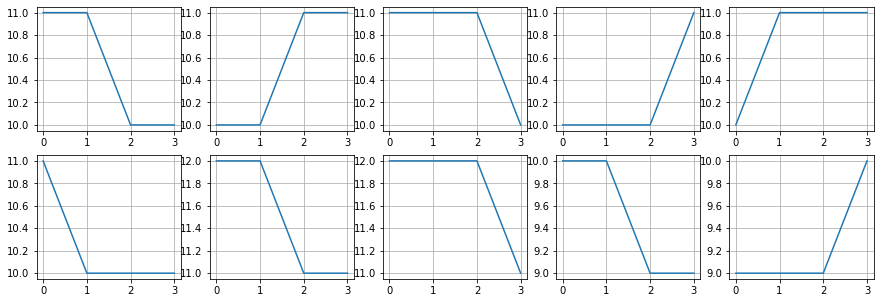

Dispersion Entropy
==================
.. image:: https://raw.githubusercontent.com/spkit/spkit.github.io/master/assets/images/nav_logo.svg
   :width: 200
   :align: right
   :target: https://nbviewer.org/github/Nikeshbajaj/Notebooks/blob/master/spkit/SP/Dispersion_Entropy_1_demo_EEG.ipynb
-----------------------------------------------------------------------------------------------------------------

Backgorund
----------
Unlike usual entropy, Dispersion Entropy take the temporal dependency into accounts, same as Sample Entropy and Aproximate Entropy. It is Embeding Based Entropy function. The idea of Dispersion is almost same as Sample and Aproximate, which is to extract Embeddings, estimate their distribuation and compute entropy. However, there is a fine detail that make dispersion entropy more usuful. 

* First, is to map the distribuation original signal to uniform (using CDF), then divide them into n-classes. This is same as done for quantization process of any normally distributed signal, such as speech. In quantization, this mapping helps to minimize the quantization error, by assiging small quantization steps for samples with high density and large for low. Think this in a way, if in a signal, large number of samples belongs to a range (-0.1, 0.1), near to zero, your almost all the embeddings will have at least one value that is in that range. CDF mapping will avoid that. In this python implimentation, we have included other mapping functions, which are commonly used in speech processing, i.e. A-Law, and µ-Law, with parameter A and µ to control the mapping.

* Second, it allows to extract Embedding with delay factor, i.e. if delay is 2, an embeding is continues samples skiping everu other sample. which is kind of decimation. This helps if your signal is sampled at very high sampling frequecy, i.e. super smooth in local region. Consider you hhave a signal with very high smapling rate, then many of the continues samples will have similar values, which will lead to have a very high number of contant embeddings.

* Third, actuall not so much of third, but an alternative to deal with signal with very high sampling rate, is by scale factor, which is nothing but a decimator.

An Example
--------
::
  
  import numpy as np
  import matplotlib.pyplot as plt
  import spkit as sp
  
  X,ch_names = sp.load_data.eegSample()
  fs=128
  
  #filtering 
  Xf = sp.filter_X(X,band=[1,20],btype='bandpass',verbose=0)
  
  Xi = Xf[:,0].copy() # only one channel
  
  de,prob,patterns_dict,_,_= sp.dispersion_entropy(Xi,classes=10, scale=1, emb_dim=2, delay=1,return_all=True)
  print(de)

2.271749287746759

Important Note:  **Log base**
~~~~~~

The Entropy here is computed as  :math:`-\sum p(x)log_e (p(x))` , natural log. **To convert to log2, simply divide the value with np.log(2)**

::
   
   de/np.log(2)

3.2774414315752844

**Probability of all the patterns found**

::
  
  plt.stem(prob)
  plt.xlabel('pattern #')
  plt.ylabel('probability')
  plt.show()

.. image:: https://raw.githubusercontent.com/Nikeshbajaj/spkit/master/figures/DE_pat_1.png
  

Pattern dictionary

::
  
  patterns_dict

:: 
   
   {(1, 1): 18,
    (1, 2): 2,
    (1, 4): 1,
    (2, 1): 2,
    (2, 2): 23,
    (2, 3): 2,
    (2, 5): 1,
    (3, 1): 1,
    (3, 2): 2,  
  

top 10 patters

::
  
  PP = np.array([list(k)+[patterns_dict[k]] for k in patterns_dict])
  idx = np.argsort(PP[:,-1])[::-1]
  PP[idx[:10],:-1]

::
   
   array([[ 5,  5],
          [ 6,  6],
          [ 4,  4],
          [ 7,  7],
          [ 6,  5],
          [ 5,  6],
          [10, 10],
          [ 4,  5],
          [ 5,  4],
          [ 8,  8]], dtype=int64)
       

Embedding diamension 4
--------     

::
  
  de,prob,patterns_dict,_,_= sp.dispersion_entropy(Xi,classes=20, scale=1, emb_dim=4, delay=1,return_all=True)
  de

4.86637389336799

top 10 patters

::
   
   PP = np.array([list(k)+[patterns_dict[k]] for k in patterns_dict])
   idx = np.argsort(PP[:,-1])[::-1]
   PP[idx[:10],:-1]

::
   
   array([[10, 10, 10, 10],
          [11, 11, 11, 11],
          [12, 12, 12, 12],
          [ 9,  9,  9,  9],
          [11, 11, 10, 10],
          [10, 10, 11, 11],
          [11, 11, 11, 10],
          [10, 10, 10, 11],
          [10, 11, 11, 11],
          [11, 10, 10, 10]], dtype=int64)

top-10, non-constant pattern

::
  
   Ptop = np.array(list(PP[idx,:-1]))
   idx2 = np.where(np.sum(np.abs(Ptop-Ptop.mean(1)[:,None]),1)>0)[0]
   plt.plot(Ptop[idx2[:10]].T,'--o')
   plt.xticks([0,1,2,3])
   plt.grid()
   plt.show()
   
   
   

::
  
  plt.figure(figsize=(15,5))
  for i in range(10):
       plt.subplot(2,5,i+1)
       plt.plot(Ptop[idx2[i]])
       plt.grid()

Dispersion Entropy with sliding window
--------     

::
  
  de_temporal = []
  win = np.arange(128)
  while win[-1]<Xi.shape[0]:
      de,_ = sp.dispersion_entropy(Xi[win],classes=10, scale=1, emb_dim=2, delay=1,return_all=False)
      win+=16
      de_temporal.append(de)x
      
   
  plt.figure(figsize=(10,3))
  plt.plot(de_temporal)
  plt.xlim([0,len(de_temporal)])
  plt.xlabel('window')
  plt.ylabel('Dispersion Entropy')
  plt.show()
  
  
.. image:: https://raw.githubusercontent.com/Nikeshbajaj/spkit/master/figures/DE_temp_1.png
  

Dispersion Entropy multiscale
--------

::
  
  
  for scl in [1,2,3,5,10,20,30]:
     de,_ = sp.dispersion_entropy(Xi,classes=10, scale=scl, emb_dim=2, delay=1,return_all=False)
     print(f'Sacle: {scl}, \t: DE: {de}')
     
     
::

   Sacle: 1, 	: DE: 2.271749287746759
   Sacle: 2, 	: DE: 2.5456280627759336
   Sacle: 3, 	: DE: 2.6984938704051236
   Sacle: 5, 	: DE: 2.682837351130069
   Sacle: 10, 	: DE: 2.5585556625642476
   Sacle: 20, 	: DE: 2.7480275694000103
   Sacle: 30, 	: DE: 2.4767472897625806

::
  
  help(sp.dispersion_entropy)
  

Mltiscale-refined Dispersion Entropy
--------

::
  
  de,_ = sp.dispersion_entropy_multiscale_refined(Xi,classes=10, scales=[1, 2, 3, 4, 5], emb_dim=2, delay=1)
  print(de)
 

2.543855087400606

::
  
  help(sp.dispersion_entropy_multiscale_refined)

`View in Jupyter-Notebook for details <https://nbviewer.org/github/Nikeshbajaj/Notebooks/blob/master/spkit/SP/Dispersion_Entropy_1_demo_EEG.ipynb>`_
----------------

.. image:: https://raw.githubusercontent.com/spkit/spkit.github.io/master/assets/images/nav_logo.svg
   :width: 100
   :align: right
   :target: https://nbviewer.org/github/Nikeshbajaj/Notebooks/blob/master/spkit/SP/Dispersion_Entropy_1_demo_EEG.ipynb

-----------   
